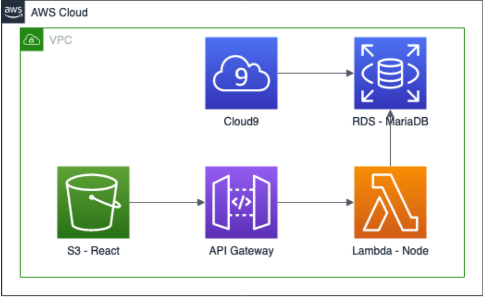

# Legacy Code READ ME 
This is an explanation of the legacy code based on research,
meetings with the previous capstone team leader, and documentation.
The basis for this documentation was created by the 2020 Capstone team
and will be updated accordingly as we progress through updating the 
PWA.

## Sponsor  
Professor Heather Bateman - Professor and Researcher of Biology

## Contributors (2022 Capstone Team)
- Isaiah Lathem
- Jack Norman
- Dennis Grassl
- Ian Skelskey
- Zachary Jacobson

### Overview

The FieldDay Capture-Mark-Recapture (CMR) application is hosted on AWS and is made up of 3 components. The static 
front-end component is hosted on the S3 bucket, the back-end is accessed using Lambda, and the data is stored on an RDS 
MySQL instance. There are both live and test versions of each of these components, all of which have been configured 
appropriately per their environment. Updates need to be performed occasionally to each of these components, and this 
document details how to access and update each component.

[Link to web app](http://fieldday-react-prod.s3-website.us-east-2.amazonaws.com/login )  
[Link to test website](http://fieldday-react-test.s3-website.us-east-2.amazonaws.com/login)

### Requirements
1. **AWS**- Administrator access to the AWS account is required for the front-end and Cloud9 components. The current 
administrator should give new team members access to AWS.  
2. **Github (or another git repo)**- The source code for both the front- and back-end will be required to deploy. The 
master branch is used for deploying the live environment, and the dev branch is used for deploying to the test 
environment.
3. **Command line**- A command line interface (CLI) tool will be needed to interact with the serverless and build the 
front-end. The [npm Javascript utility](https://www.npmjs.com/get-npm) needs to be installed globally.

### System Architecture
Below is a diagram of how the project is hosted on AWS:  



All components of the project are contained in the same hosted on the same VPC (the default) and can be interacted with 
by either the S3 bucket, which is set up to be accessed publicly, or from the API gateway, which has access to the back-end.

### Setup
N/A

### Technical Details
**React Front-End to S3**

The front-end will be deployed statically to the designated S3 bucket. The process is the same for both the live and 
test environments, the only difference being the name of the bucket:
- Live: ```fieldday-react-prod```
- Test: ```fieldday-react-test```

The process is the same for both save changes in environment variables and the bucket location. Follow the instructions 
below to run the project locally and deploy it to AWS. Note that if you want to run locally, you will only need to go to
step 7:
1. Clone the React front-end project from the project repository (varies per where the project is stored).  
```git clone https://<your-repository>/fieldday-react```  

2. Change difrectories to the root of the project   
```cd fieldday-react```
3. By default, you will have the master branch checked out. If you are uploading to the test environment, checkout the 
dev branch (or whatever branch you want to upload to the test environment).
```git checkout development```
4. Install the proejct dependencies  
```npm install```
5. If you are running the application for the first time, you will need to create a .env file, which will store the 
environment variables necessary to deploy the project. Create or edit the .env file with the following variables:  
```REACT_BATEMAN_BUILD=`true```  
```REACT_APP_DB_SERVER_ADDRESS=https://jedp118q50.execute-api.us-east-2.amazonaws.com/production/```  
   If you are deploying the test environment, change the REACT_APP_DB_SERVER_ADDRESS to:  
   ```REACT_BATEMAN_BUILD=`true```  
   ```REACT_APP_DB_SERVER_ADDRESS=https://jedp118q50.execute-api.us-east-2.amazonaws.con/test/```  
6. Build the React app  
```npm run build```
7. If you are going to run locally, run the app start command. Note that you need to be running the back-end before
this step so that you can retrieve the appropriate endpoints.
```npm run app:start```
8. To deploy to the S3 bucket, open 2 windows:  
   a. A  File Explorer for Windows, the Finder on Mac, or the File Manager for Linux
   (name may vary based on Linux distribution).  
   b. A browser to the S3 bucket (see URLs in overview)
9. In your file manager, navigate to the root of the project, and then into the ​build​folder.
10. Highlight/select all the files in the ​build​folder, and drag-and-drop them into the S3 bucket window.
11. For each of the prompts, select Next, Continue, and then Create (keeping the defaults for all).
12. Test that everything uploaded successfully by navigating to the website and logging in.  

#### Deploy the Node.js Back-end to Lambda
The back-end will be deployed as a Lambda function. The process is the same for both save the serverless deploy command.
1. Clone the Node backend-end project from the project repository (varies per where the project is stored).  
```git clone https://<your-repository>/fieldday-node```
2. Change directories to the root of the project 
```cd fieldday-node```
3. By default, you will have the master branch checked out. If you are uploading the test environment, checkout 
the dev branch (or whatever branch you want to upload to the test environment).
```git checkout dev```
4. Install project dependencies 
```npm install```
5. If you want to run the server locally, run the server start command.  
```npm run server:start```
6. To deploy, run the serverless deploy command from the root of the project:  
```#production```  
```serverless deploy --stage production```  
      or  
```#development (test)```  
```serverless deploy --stage deverlopment```  
7. The command will take a few minutes to deploy. Once it’s complete an endpoint will be shown in the console.
   
### Troubleshooting
N/A
### References 
N/A